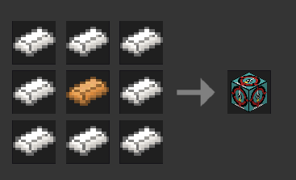
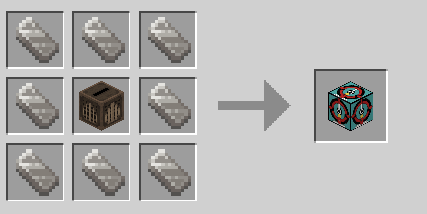

# 🚨 Alarm Siren: Protect & Secure Your Builds!

Looking to secure your secret base, build an industrial complex, or just warn your friends when danger is near? The **Alarm Siren** mod for Luanti (Minetest) is your ultimate emergency alert system! 

With simple placing, instant activation, and a realistic wailing siren, this block is the perfect addition to any world, server, or roleplay setup.

---

## ⚡ Key Features

* **🔊 Loud & Realistic Alert:** Plays a high-quality, attention-grabbing siren sound that can be heard up to **64 blocks away**.
* **🖱️ Dual-Toggle Activation:** Turn it on or off easily! Right-click the block or double-punch (double-click) it to activate the alarm.
* **👀 Visual Status:** Look at the siren block anytime to see its current state (Active or Inactive) right in your tooltip.
* **🛠️ Survival & Creative Ready:** Easily craftable in standard Minetest Game (MTG) or MineClone2/VoxeLibre survival worlds, or pull it straight from creative mode!
* **📦 Light & Fast:** Designed to run smoothly on any server or local world without causing lag.

---

## 🛠️ How to Use & Craft

### 1. Crafting Your Siren

**Minetest Game (MTG) Recipe:**
* Place Steel Ingots around a central Copper Ingot:
  ```text
  [Steel Ingot]  [Steel Ingot]   [Steel Ingot]
  [Steel Ingot]  [Copper Ingot]  [Steel Ingot]
  [Steel Ingot]  [Steel Ingot]   [Steel Ingot]
  ```
  *(Uses `default:steel_ingot` and `default:copper_ingot`)*

  

**MineClone2 / VoxeLibre Recipe:**
* Place Iron Ingots around a central Jukebox (yes, you literally build a Jukebox inside to blast the siren! 🎵):
  ```text
  [Iron Ingot]  [Iron Ingot]  [Iron Ingot]
  [Iron Ingot]  [Jukebox]     [Iron Ingot]
  [Iron Ingot]  [Iron Ingot]  [Iron Ingot]
  ```
  *(Uses `mcl_core:iron_ingot` and `mcl_jukebox:jukebox`)*

  

*Or use `/give alarm_siren:siren` to grab one instantly!*

### 2. Setting Up Your Alarm
1. **Place** the Alarm Siren block wherever you need a warning system.
2. **Right-click** or **double-punch** the block to activate it. The siren will start wailing!
3. To silence the alarm, simply **right-click** or **double-punch** it again.

---

## 🎮 Great For:
- **Base Defense:** Alert yourself when invaders approach your territory.
- **Industrial Roleplay:** Build realistic power plants, factories, and military bunkers.
- **Server Events:** Signal the start of games, PVP matches, or nighttime alerts.

---

## 🧩 Compatibility & Requirements
* Works on **Luanti (Minetest) 5.0+**
* Seamlessly supports **Minetest Game (MTG)**, **MineClone2**, and **VoxeLibre** right out of the box!
